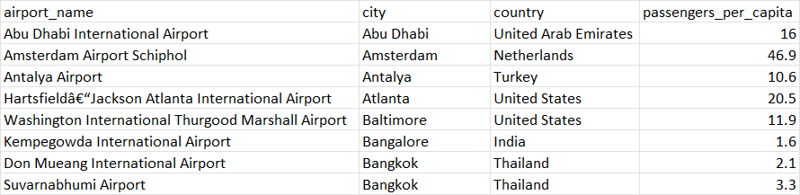
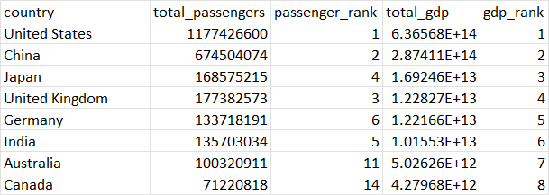
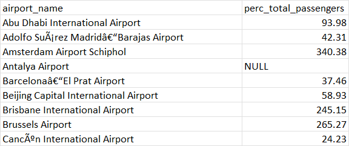
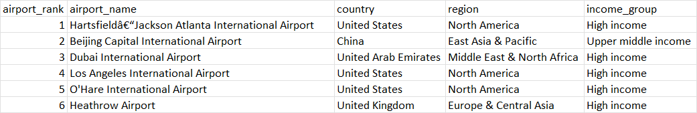
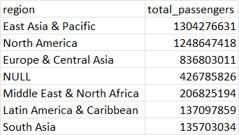
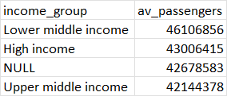
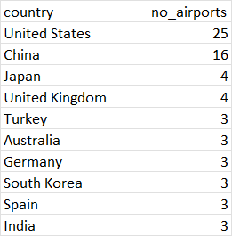
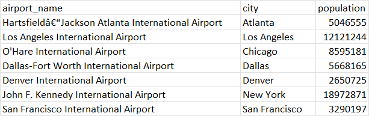
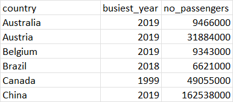

**Number of passengers per capita**
The number of passengers per capita (city) 

```SQL
SELECT ai.airport_name
	  ,ai.city
	  ,ai.country
	  ,TRUNC((ai.no_passengers::numeric/po.population::numeric), 1) AS passengers_per_capita 
FROM airports ai
LEFT JOIN population po ON ai.city = po.city
ORDER BY ai.city;
```




**Do countries with the busiest airports (by number of passengers) have higher GDP**

```SQL
SELECT ai.country 
	   ,SUM(ai.no_passengers) AS total_passengers
	   , RANK () OVER(
	    ORDER BY SUM(ai.no_passengers) DESC
	   ) passenger_rank
	   	,SUM(gd.gdp) AS total_gdp 
	   ,RANK () OVER(
	    ORDER BY SUM(gd.gdp) DESC NULLS LAST
	   ) gdp_rank 
FROM airports ai
LEFT JOIN gdp gd ON ai.country = gd.country_name
GROUP BY ai.country
ORDER BY gdp_rank; 
```




**Number of passengers at each airport as a percentage of their country's 2019 total number of international tourism arrivals*
need to keep in mind that the number of passesngers might include both incoming and outgoing as well as domestic travellers. We also don't know what year the number of passengers at each airport is from. 

```SQL
SELECT ai.airport_name
	  ,ROUND((ai.no_passengers/n.y_2019)* 100, 2) AS perc_total_passengers
FROM airports ai
LEFT JOIN no_arrivals n ON ai.country = n.country_name
ORDER BY airport_name;
```



As seen in the results some airports have a percentage of over 100 of their country's total international arrivals, this is not the best way to view this data. 


**Query of airports, their region and income group**

```SQL
SELECT ai.airport_rank
	  ,ai.airport_name
	  ,ai.country
	  ,me.region
	  ,me.income_group
FROM airports ai
LEFT JOIN metadata me ON ai.country = me.name;
```




**Query of which regions have the highest total number of airline passengers**

```SQL
SELECT me.region
	  ,SUM(ai.no_passengers) AS total_passengers 
FROM airports ai 
LEFT JOIN metadata me ON ai.country = me.name
GROUP BY me.region
ORDER BY total_passengers DESC;
```




**Query of which income group has the highest average number of passengers**

```SQL
SELECT me.income_group
	  ,ROUND(AVG(ai.no_passengers)) AS av_passengers 
FROM airports ai 
LEFT JOIN metadata me ON ai.country = me.name
GROUP BY me.income_group
ORDER BY av_passengers DESC;
```




**Query of how many top airports each country on the top 100 list has**

```SQL
SELECT country
	  ,COUNT(country) AS no_airports
FROM airports 
GROUP BY country
ORDER by no_airports DESC;
```




**Query of the population of the city of US airports in the top 100 airports**

```SQL
SELECT ai.airport_name
	  ,ai.city
	  ,po.population
FROM airports ai
LEFT JOIN population po ON ai.city = po.city
WHERE ai.country LIKE 'United States'
ORDER BY airport_rank;
```



**Which year had the highest number of international arrivals for each country in the top 100 airports list**

```SQL 
SELECT DISTINCT ai.country
			   ,CASE GREATEST(na.y_1995, na.y_1996, na.y_1997, na.y_1998, na.y_1999, na.y_2000, na.y_2001,
						na.y_2002, na.y_2003, na.y_2004, na.y_2005, na.y_2006, na.y_2007, na.y_2008,
						na.y_2009, na.y_2010, na.y_2011, na.y_2012, na.y_2013, na.y_2014, na.y_2015,
						na.y_2016, na.y_2017, na.y_2018, na.y_2019, na.y_2020)
							WHEN na.y_1995 then '1995'
							WHEN na.y_1996 then '1996'
							WHEN na.y_1997 then '1997'
							WHEN na.y_1998 then '1998'
							WHEN na.y_1999 then '1999'
							WHEN na.y_2000 then '2000'
							WHEN na.y_2001 then '2001'
							WHEN na.y_2002 then '2002'
							WHEN na.y_2003 then '2003'
							WHEN na.y_2004 then '2004'
							WHEN na.y_2005 then '2005'
							WHEN na.y_2006 then '2006'
							WHEN na.y_2007 then '2007'
							WHEN na.y_2008 then '2008'
							WHEN na.y_2009 then '2009'
							WHEN na.y_2010 then '2010'
							WHEN na.y_2011 then '2011'
							WHEN na.y_2012 then '2012'
							WHEN na.y_2013 then '2013'
							WHEN na.y_2014 then '2014'
							WHEN na.y_2015 then '2015'
							WHEN na.y_2016 then '2016'
							WHEN na.y_2017 then '2017'
							WHEN na.y_2018 then '2018'
							WHEN na.y_2019 then '2019'
							WHEN na.y_2020 then '2020'
						END busiest_year
			 ,GREATEST(na.y_1995, na.y_1996, na.y_1997, na.y_1998, na.y_1999, na.y_2000, na.y_2001,
						na.y_2002, na.y_2003, na.y_2004, na.y_2005, na.y_2006, na.y_2007, na.y_2008,
						na.y_2009, na.y_2010, na.y_2011, na.y_2012, na.y_2013, na.y_2014, na.y_2015,
						na.y_2016, na.y_2017, na.y_2018, na.y_2019, na.y_2020) AS no_passengers
FROM airports ai
LEFT JOIN no_arrivals na ON ai.country = na.country_name
ORDER BY country;
```




